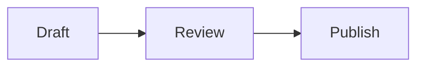

# User guide

[Documentation index](README.md)

This guide describes the behavior implemented by the current Mint Notes release. Deployment and server administration are covered separately in the [deployment guide](DEPLOYMENT.md).

## Create or activate an account

Mint Notes supports English, Simplified Chinese, and Traditional Chinese. On first use, the login page checks the browser's preferred-language list and uses the first supported match; if none matches, it uses English. The language selector on the login page can instead follow the browser or select any supported language explicitly. This browser-local choice remains available before login.

The login page provides **Register** and **Forgot password** actions. The first account created on an empty server becomes the administrator even when public registration is disabled. The registration page identifies this one-time bootstrap case.

Later accounts use one of two paths:

- Public registration, only when the server administrator enables it. The registration form also links to activation-code registration.
- A 72-hour, one-time activation code created under **Settings > Administrator settings**. When public registration is disabled, **Register** opens this path directly and explains that an activation code must be requested from an administrator.

Usernames are 3-48 characters and use lowercase letters, numbers, `.`, `_`, or `-`. A master password must contain at least 10 characters.

Account creation displays a recovery key once. Save it before entering the vault. The server cannot recreate the master password, recovery key, or vault key.

Use **Forgot password** to reset a master password with the account's recovery key. Without that recovery key, the encrypted vault cannot be recovered.

## Understand the layout

Desktop uses three panes:

- **Left:** application branding, pinned shortcuts above search, local search, compact new-note/new-folder controls plus a right-aligned collapse-all/current-note-location/sort group, and the active note/folder tree. The tree scrolls independently while the account identity, settings, and lock icon buttons remain in one anchored bottom row.
- **Center:** note title, live/source/reading modes, note lock and image attachment actions, sidebar controls, and save/sync status.
- **Right:** a tool panel with tabs for the outline generated from Markdown headings and the active note's encrypted version history.

All three panes scroll vertically on their own. On desktop, drag either divider to resize its sidebar. The active note, its Live/Source/Reading mode, the collapsed state and widths of both sidebars, and the selected Outline/History tab are remembered per user in that browser or installed PWA and are never synchronized. Returning on the same device restores that device's workspace; another browser profile or newly signed-in device starts with an empty editor until you open a note. Clearing site data or confirming logout removes the remembered workspace. On phone-sized screens, the sidebars become drawers opened from the editor toolbar. You can also swipe inward from the left screen edge to open the directory drawer or from the right screen edge to open the Outline/History drawer. In the directory drawer, one tap opens a note or expands or collapses a folder; the `…` action remains visible on touch devices without requiring a hover gesture. Selecting a history version closes the right drawer and shows the read-only preview in the center.

Status and warning messages, including transient results from Settings and Administrator settings, appear as notifications in the upper-right corner without changing the editor or modal layout. Progress and success notices disappear after four seconds, and routine warnings after seven seconds. Critical storage or conflict notices remain until closed manually. Persistent one-time results that must be copied or saved, such as recovery keys and activation codes, remain inside their settings section.

## Organize notes and folders

Use the new-note or new-folder icon above the tree to create a root item. A new note opens with its complete default title selected in the title field, ready to replace by typing. A new folder opens an inline name field in the tree with its complete default name selected; press Enter or leave the field to save the name, or press Escape to keep the generated default. The same behavior applies when creating child items from a folder's contextual menu. The right-aligned collapse-all button immediately closes every expanded folder. The adjacent location button clears the current search, expands every ancestor folder, selects the active note, and scrolls its tree row into view. The sort icon opens the sorting choices.

Creating a note opens it in **Live** mode even if the previously viewed note was in Source or Reading mode, so the new note is immediately editable. A verified empty account receives a welcome note in the interface language active during its first unlock.

Note and folder names share one namespace within each directory. Creating another unnamed note adds `2`, `3`, and so on to the localized **Untitled note** name; folders use the same numbering behavior starting with the localized **New folder** name. Importing, duplicating, and conflict-copy creation also select an available sibling name automatically. Renaming, moving, or restoring an item is blocked when it would create a duplicate name in the destination directory. Items in trash do not reserve their former names.

Items can be dragged:

- Drop a note or folder into the middle of a folder row to move it inside. The destination folder is highlighted while it is ready to accept the item.
- In **Manual** sorting, drop near the upper or lower edge of a row to reorder siblings.
- In A-Z, creation-time, or modification-time sorting, dragging can still change the parent folder but does not override the selected sort order.

Click an item to select it. Hold `Ctrl` on Windows/Linux or `Command` on macOS while clicking to add or remove individual notes and folders from the selection. Hold `Shift` while clicking to select a continuous range in the currently visible tree order; collapsed descendants are not part of that range. Right-click any selected row to move, drag, pin, duplicate, export, or trash the selection as a batch. Pinned notes and folders also appear as shortcuts in the **Pinned** section above the file tree and can be unpinned from either location. Their original position and folder hierarchy do not change. When both a folder and one of its descendants are selected, recursive operations process that subtree only once. Opening, renaming, and creating children remain single-item actions.

A folder cannot be moved into itself or one of its descendants.

Open the contextual menu with right-click or the `…` button. It provides open, rename, move, pin or unpin, create child, duplicate, export, and move-to-trash actions as applicable. Renaming a note or folder opens an inline name field on that item in the file tree instead of a browser dialog; press Enter or leave the field to save, or press Escape to cancel. Duplicating a folder recursively copies its descendants. Attached images receive new IDs and keys in a copied note.

Locked notes can still be moved normally, pinned, copied, exported, and opened from WikiLinks. A copied note is unlocked so it can be edited independently. A folder may still be renamed or moved when it contains locked notes, but neither the folder nor a larger batch containing it can be moved to trash until every locked descendant has been unlocked.

## Edit Markdown

The center toolbar provides three modes:

- **Live:** Typora-style editing with Markdown rendered in place.
- **Source:** edit the canonical Markdown text directly.
- **Reading:** render the current Markdown without editing controls.

Markdown remains the canonical note format in every mode. Switching modes does not convert it to a proprietary document format. The right outline is generated from H1-H6 headings and never uploads as separate plaintext metadata.

Use the lock button immediately to the left of the image action, or **Lock note** in a single note's contextual menu, to protect it from accidental editing or deletion. Locking the current note saves pending title and editor changes locally first, then shows the note in Reading mode without changing this device's remembered Live/Source/Reading choice. Live and Source are disabled while the note is locked; the title, YAML properties, and **Restore as current** history action are also unavailable. The image action remains visible but disabled to keep the toolbar layout stable. Use the same toolbar or contextual-menu action to unlock it and restore the underlying device-local mode. Changing only the lock state does not change the note's modification time. The file tree and pinned shortcuts show a small lock badge on protected notes.

The note lock is an encrypted, cross-device client-side safety control, not password protection or a server authorization rule. It does not require a PIN or master password. Updated clients synchronize it with the note; if a remote lock arrives while that note is actively open, the existing active-note deferral rule applies and the lock becomes visible after leaving and reopening the note.

In Live mode, a line-leading `>` remains visible while you type. Press Enter to confirm the completed line and render it as a blockquote, matching the delayed conversion used for headings. The Live editor does not automatically insert backslashes before any punctuation. To request a literal Markdown-significant symbol, type the backslash yourself in Live or Source mode—for example, `\>` displays as an ordinary `>` instead of starting a blockquote. Live mode hides that user-authored escape while the canonical Markdown retains it across reloads.

### Math, diagrams, and WikiLinks

Use `$...$` for inline KaTeX and `$$...$$` for display math. Display math may occupy one line or use opening and closing `$$` lines:

```markdown
Euler's identity is $e^{i\pi} + 1 = 0$.

$$
\int_0^1 x^2\,dx = \frac{1}{3}
$$
```

Live and Reading modes render the formula; Source mode always shows the canonical delimiters. Selecting an inline formula or activating a display formula reveals its editable source in Live mode. Math inside inline-code spans or fenced code blocks remains literal.

Put Mermaid source in a fenced block whose language is `mermaid`:

````markdown

````

The browser renders Mermaid locally. Activating a diagram in Live mode reveals its fenced source. Diagram links and scripts are not interactive, external resource references are removed, and a diagram that cannot be parsed remains available in Source mode.

WikiLinks use `[[Note title]]`. Add `|Label` to choose the displayed text, use a folder path to disambiguate duplicate titles, and append `#Heading` to open a section:

```markdown
[[Setup]]
[[Guides/Setup|Setup guide]]
[[Setup#Install]]
[[#Local heading]]
```

A title-only WikiLink prefers a note in the current folder, then another matching live note. A folder path starts at the vault root. Missing targets show a notice; Mint Notes does not create a note implicitly. WikiLinks remain ordinary portable Markdown text in exports, so tools without WikiLink support can still display their source.

### Callouts

Place an Obsidian-style callout marker on the first line of a blockquote:

```markdown
> [!TIP]
> Keep the recovery key somewhere safe.

> [!WARNING]- Optional details
> This callout starts collapsed in Reading mode.
```

Mint Notes recognizes every built-in Obsidian type and alias: Note; Abstract/Summary/TLDR; Info; Todo; Tip/Hint/Important; Success/Check/Done; Question/Help/FAQ; Warning/Caution/Attention; Failure/Fail/Missing; Danger/Error; Bug; Example; and Quote/Cite. Aliases use the same color and icon as their official type while keeping the alias as the default title, such as Important or Caution. Type names are case-insensitive. Unknown names use a neutral style so custom callouts remain readable. Add a space and text after the marker for a custom title—for example, `> [!TIP] Custom title`. In Live mode, click anywhere in the rendered header row to reveal the complete marker source, including its leading quote prefix, such as `> [!TIP] Custom title`. Clicking within an authored title places the caret near that character; clicking the icon or empty header space places it at the end of the marker. Moving the caret away restores the rendered icon and title. A `+` suffix makes the callout collapsible and initially expanded; `-` makes it initially collapsed. Live mode keeps every callout expanded so its Markdown remains editable. Reading mode and historical previews honor the requested fold state.

An optional Mint Notes appearance block may follow the title:

```markdown
> [!TIP]+ Deployment {color=purple icon=important}
> Verify the backup before upgrading.
```

`color` accepts `gray`, `blue`, `cyan`, `green`, `purple`, `amber`, `red`, or `rose`. `icon` accepts these Mint Notes icon identifiers: `note`, `abstract`, `info`, `todo`, `tip`, `important`, `success`, `question`, `warning`, `caution`, `failure`, `danger`, `bug`, `example`, `quote`, or `custom`. Invalid or unknown attribute blocks remain part of the visible title instead of being discarded. Other Markdown tools may show the `{...}` block as title text because these appearance attributes are a Mint Notes extension.

In Live mode, deleting the last body text leaves one empty quoted line so the caret remains editable. Press Backspace again while that body is empty to move the caret to the end of the `[!TYPE]` marker. At the start of the marker text, Backspace removes the currently visible quote level using the editor's normal blockquote behavior; nested Callouts expose every level as `> > ` and remove one level at a time. If you continue deleting and make the marker incomplete, such as `> [!CAUTION`, the Callout immediately becomes an ordinary blockquote while preserving the incomplete marker and surrounding content. Retype `]` to restore the Callout style. Delete follows the editor's normal behavior and does not remove the entire Callout block. Standard undo restores each editing step. The callout frame follows added or removed body lines immediately. Live editing preserves the canonical `> [!TYPE]` marker directly and does not add highlight/backtick sentinels or synthesize backslash escapes.

### YAML properties

Valid YAML frontmatter at the very top of a note appears as a properties panel in Live and Reading modes:

```yaml
---
version:
description:
created:
modified: "{{date}}"
tags:
---
```

In Live mode, edit, rename, add, or remove top-level scalar properties and simple scalar lists directly in the panel. Boolean values use checkboxes, ISO dates use date inputs, and lists such as `tags` use value chips. Reading mode and historical previews show the same properties read-only. Source mode always exposes the complete original YAML.

Nested objects, nested lists, multiline values, anchors, and aliases are shown read-only in the panel and must be edited in Source mode. Invalid YAML is preserved unchanged and shown with a source-editing notice. Notes without frontmatter do not show a properties panel. Mint Notes never evaluates template text such as `{{date}}` and does not automatically create or update `created` or `modified`.

The left side of the status bar shows the active note's creation time, latest modification time, and local save or synchronization state. Moving the caret or changing the selection without changing the title or Markdown does not update the modification time. The right side counts words with language-aware segmentation. Punctuation is excluded from the word count. The character count excludes whitespace but includes symbols.

## Use note history

Open **History** in the right tool panel to browse the active note's saved versions. Versions are grouped by day. Select one to replace the center editor with a read-only historical preview; **Exit preview** returns to the current note without changing it.

Automatic history is enabled by default. During an editing session Mint Notes saves the state before editing when the configured interval has elapsed, records checkpoints every 10 minutes by default during continuous editing, and records the final state after two minutes without content changes. Identical content is not saved twice. **Save current version** creates a manual checkpoint even when automatic history is disabled.

Automatic versions are thinned as they age: all are kept for 24 hours, then the newest version per hour through day 7, and the newest version per day afterward. Manual and pre-restore safety versions are not thinned. All versions remain subject to the account retention setting, which defaults to 90 days.

Historical preview provides two restore actions:

- **Restore as current:** first saves the current note as a protected local checkpoint, then writes the historical title, Markdown, tags, and attachment references as a normal new local-first revision. Folder position, favorite state, creation time, and ordering are preserved.
- **Restore as copy:** creates a new sibling note and gives every referenced attachment a new UUID and encryption key. The original note is unchanged. The operation stops if all referenced attachments cannot be recovered.

Deleting one version, clearing the current note's history, and clearing all account history require an online connection and explicit confirmation. Moving a note to trash keeps its history; permanently deleting the note removes its history. Open **Settings > Note history** to disable automatic capture, select a 5/10/30/60-minute interval, choose a 7/30/90/180/365-day or permanent retention period, inspect encrypted history usage, or clear all versions. The server enforces a separate 256 MiB per-user history quota by default.

## Add images

Drop a supported image into the live or source editor to insert it at the drop position. The image toolbar button provides a file-picker fallback.

After local encryption finishes, an inserted image appears in the active note without requiring a refresh. It remains available when switching among Live, Source, and Reading modes; the temporary in-memory Blob URL used for display is never written into the canonical Markdown.

Supported formats are PNG, JPEG, GIF, WebP, and AVIF. The browser verifies file signatures and rejects SVG. The bundled client limits each image to 25 MiB.

Each image is encrypted locally with its own random key and UUID before synchronization. Other devices download encrypted chunks only when the owning note is opened. Decrypted Blob URLs exist only in memory while required by the active note.

An attachment belongs to one note. Copying the note creates a separate encrypted attachment. Moving a note to trash also tombstones its attachments; restoring the note restores them.

## Local save and synchronization

Editing never waits for a network request. After half a second without input, or at least once every five seconds during continuous typing, the browser encrypts the latest document and atomically writes both the encrypted object and a durable outbox entry to IndexedDB. Network uploads combine nearby changes and send the latest durable version after two seconds of inactivity or at least once every fifteen seconds during continuous editing. Once acknowledged, the server is the durable cross-device copy; the local encrypted store exists as a low-latency working cache and retry queue.

The status bar reports:

- **Ready:** no save is currently running.
- **Saving:** encryption and local persistence are in progress.
- **Saved locally:** the encrypted local copy is durable and still needs server acknowledgement.
- **Syncing:** queued ciphertext is being uploaded or remote changes are being pulled.
- **Synced:** no local object or attachment chunk remains in the outbox.
- **Offline · saved locally:** editing can continue in the unlocked vault; synchronization resumes after reconnecting.
- **Synchronization problem:** the local encrypted copy remains available and the app will retry.

Synchronization pulls remote changes at startup after unlock, after reconnecting, when the page becomes visible, and when the server sends a lightweight change notification. It no longer performs a complete synchronization every five seconds. While the unlocked page is visible, a five-minute safety check covers missed notifications; hidden and locked pages do not poll. Attachment chunks upload before their manifest and owning note update.

Remote changes are applied to the local encrypted database in batches so a large update does not remove or redraw tree items one by one. Workspace choices are device-local, so synchronization never switches the active note, editor mode, or sidebar state. If the currently edited note changes or is deleted on another device, Mint Notes keeps the current editor stable and shows a notification; the remote version appears after leaving the note, or the local draft is retained as a conflict copy when both devices edited it. Pulling back the exact encrypted revision that this browser already uploaded and acknowledged advances synchronization silently and does not show an “updated on another device” notification.

If one encrypted local or remote object cannot pass decryption and integrity checks, Mint Notes isolates that object instead of aborting the whole vault load. Other readable notes remain visible, the original local ciphertext and any pending edits are retained, and a full server pull is attempted when it is safe to do so. A new welcome note is created only after an online full pull confirms that the account is actually empty. The persistent local warning offers **Do not show this version again**; this records only the exact object revision and nonce in local preferences and does not delete or modify its ciphertext. A changed revision is reported again. Do not clear the site's browser data, because it may contain the only pending encrypted copy.

When two devices update the same object from the same base revision, Mint Notes does not choose a winner by timestamp. It retains the server version and creates a local note named with a localized **conflict copy** suffix for the conflicting document data.

## Search and sorting

Search runs locally over decrypted titles and Markdown. Matching descendants keep their parent folders visible so results retain context. Search terms are not sent to the server. When the search field contains text, use the clear button on its right to remove the entire query and restore the full tree.

Available sorting modes are:

- **A-Z:** folders first, then locale-aware title order.
- **Created:** newest first.
- **Modified:** most recently changed first.
- **Manual:** explicit sibling order controlled by dragging.

The selected mode is remembered per user in the current browser.

## Trash and permanent deletion

Moving an item to trash happens immediately without an extra confirmation. A locked note cannot be moved to trash. A folder or multi-item selection containing a locked note at any descendant depth is blocked as a whole until that note is unlocked. Moving an allowed folder includes its descendants; owned attachments follow their notes. Open **Settings > Trash** to browse the original deleted folder hierarchy and deletion times. Restore and permanent-delete controls appear on each deleted root and apply to its descendants.

Trash is retained for 30 days by default. Under **Settings > Trash**, choose 7, 30, 90, 180, or 365 days, or retain trash permanently. The choice saves immediately. The server applies the selected policy hourly to synchronized tombstones; other devices remove their cached copies when they receive the purge event.

Use **Clear trash** or an item's **Permanently delete** action for immediate cleanup. Both require an online connection and a second explicit confirmation. A confirmed purge removes the object's server history and associated attachment chunks and cannot be undone.

Do not use permanent deletion as a substitute for retention management. A previously created server backup or plaintext export may still contain the data.

## Import and export

Open **Settings > Import and export**.

### Export

Every Markdown or ZIP export asks for confirmation because its contents are plaintext.

- A note without attachments exports as one `.md` file.
- A note with attachments exports as ZIP.
- A folder exports only that subtree.
- A complete export retains the folder hierarchy and empty folders.
- Images are written under `_attachments/<uuid>.<ext>`, and Markdown links become portable relative paths.
- `_export.json` records the format version and original attachment-name mapping for lossless re-import.

Exports are decrypted in the browser. Markdown and ZIP output is plaintext and must be stored in a trusted or independently encrypted location. Export stops instead of silently creating an incomplete ZIP when an attachment cannot be recovered.

The lock state is application metadata rather than Markdown content, so Markdown and ZIP exports do not retain it. Imported notes and notes created from an explicit copy start unlocked.

### Import

The importer accepts Markdown, text, and ZIP files without an application-level size limit for the source file, individual note entries, or total expanded data. Available browser memory and storage still determine the practical limit. ZIP folder structure and empty directories are retained. Relative Markdown image links are converted to encrypted attachments when their files are present, valid, and within the separate 25 MiB per-image attachment limit.

The importer rejects unsafe path traversal, duplicate archive paths, archives containing more than 4,000 files, and unsupported image contents.

## Settings and account security

The settings sections are ordered as **General**, **Security**, **Trash**, **Data migration**, and **About**, followed by **Administrator settings** for administrators. Each section has a distinct navigation symbol.

Under **General**, change the display name, upload an encrypted cross-device avatar, select the interface language and theme, and choose small, standard, or large application text. Language can follow the browser or explicitly use English, Simplified Chinese, or Traditional Chinese. Language, theme, and text size save immediately in the current browser. Each user's language preference is kept with that user's device-local UI preferences and is also mirrored to the pre-login selector; it is not sent to the server. Avatar images are center-cropped to 256 by 256 pixels before browser-side encryption; the server stores only the encrypted profile asset.

Under **Security**, changing the master password rewraps the vault key rather than re-encrypting every note. The current password is required, other login sessions are revoked, and the recovery key remains unchanged.

The login page leaves **Remember this device** off by default. Without it, the session cookie belongs to the current browser session: refreshes can continue without another password, and a new tab can continue only while another authorized tab can grant it access. Browser restart detection is best effort because some browsers restore session cookies, tab state, and navigation state. With the option enabled, the browser stores a non-exportable device key and uses a rolling long-lived session. When a local PIN is configured, an ordinary refresh of an unlocked tab remains unlocked, but an ordinary application launch requires the PIN. Clearing site data or cookies can require login again.

Press Enter in the login password, PIN unlock, master-password unlock, registration confirmation, password-recovery confirmation, PIN setup, or master-password-change fields to run that form's primary confirmation action. Input-method composition and repeated keydown events do not submit, and a busy form ignores additional Enter presses.

The same section lists trusted browser endpoints rather than individual login tokens. Repeated login from the same user and browser profile preserves the first-trusted time and updates recent login, recent online time, login count, IP address, remembered status, and active state. A current endpoint must be trusted for at least 24 hours before it can sign out another endpoint. Remote sign-out revokes every session belonging to that endpoint.

The **Security** section presents **Set PIN**, **Automatic locking**, **Login devices**, and **Change master password** in that order, followed by recovery-key controls. Set a PIN of at least four characters independently after re-entering the master password; letters, numbers, and symbols are accepted. The PIN stays local and encrypts the complete persistent device-unlock envelope after its non-exportable device-key layer. The PIN-derived key is never persisted. While an unlocked tab is running, it keeps a separate encrypted refresh envelope only in that tab's browser session so an ordinary refresh can continue without asking again. Legacy PIN-verifier credentials upgrade automatically after their next successful PIN unlock. Use a longer local passphrase when protection against browser-storage theft matters because a short PIN can be guessed offline.

When a PIN is configured, each ordinary application launch requires it even if automatic locking is off. The PIN also supports manual locking. Automatic locking is an independent option: it is off by default and can be set to 1, 2, 5, 10, 15, 30, or 60 minutes after a PIN exists. Disabling automatic locking preserves both the PIN and the startup PIN requirement. Five consecutive failures clear local trust and request endpoint revocation, but the browser-local counter is damage control rather than a cryptographic defense against offline guessing. Keyboard, pointer, touch, input, and scrolling activity reset the timer; time spent on a hidden page still counts.

Locking clears the in-memory vault key, PIN-derived key, decrypted device envelope, the current tab's encrypted refresh envelope, plaintext documents, and attachment Blob URLs but preserves the authenticated endpoint, PIN-encrypted persistent credential, ciphertext cache, and synchronization outbox. The lock screen shows the current account's display name without retaining or displaying its encrypted profile avatar. Refreshing a manually or automatically locked page cannot bypass the PIN. Use the lock button beside Settings to lock immediately; if this device has no PIN yet, the application directs you to **Settings > Security > Set PIN** first. Unlock with the local PIN when configured, or use the master password as a fallback. **Log out** is available at the bottom of Settings and requires a second confirmation. Logout revokes all sessions for the current endpoint and permanently deletes this account's complete local browser data, including encrypted notes and attachment chunks, unsynchronized outboxes, local preferences, PIN, device credential, and temporary authorization state. Unsynchronized changes cannot be recovered; content already synchronized to the server is not deleted and downloads again after a later login. Other local accounts, the shared pre-login language choice, and PWA application files are not removed.

If the password is lost, choose **Forgot password**, enter the username and saved recovery key, then set a new password. Complete a recovery drill before storing irreplaceable data.

The **Recovery key** controls in **Settings > Security** verify the current master password before creating a replacement recovery key. The new key is shown once with copy and download actions; the previous key stops working immediately and is never persisted by the browser or server.

On smaller screens, Settings keeps its title and a single-row, horizontally scrollable tab bar above the independently scrolling section content. Each tab keeps its full label and icon without shrinking when a section contains more content.

The **About** section introduces Mint Notes as an AI-developed toy project focused on lightweight deployment, secure storage, simple use, responsive PWA layouts, end-to-end encryption, remote self-hosting, and familiar Markdown editing. It also shows the current application version and credits `typora-web` as the Markdown editor and Lucide React as the interface icon library.

Administrators manage activation codes and accounts under **Administrator settings > User management**, which separates **Add user** from **Existing users** so other administrator settings can be added independently. Disabling is reversible. Permanent deletion requires the administrator's master password and the exact target username, cannot target the current or last administrator, and removes that user's server database records and encrypted content without touching other users. Independent backups and ciphertext already cached in a user's browser are outside this remote deletion.

## PWA and offline behavior

Install Mint Notes from the browser's PWA/install menu after opening it over HTTPS. The application shell is cached for offline startup, and an unlocked vault can continue editing without network access.

On supported iPhones and iPads, the installed application extends its toolbar background beneath the system status area while keeping controls inside the device safe area. The time, connectivity indicators, and Dynamic Island remain system-owned and visible. Some iOS/WebKit releases may still reserve an opaque strip above Home Screen web applications; Mint Notes cannot draw into that system-owned area. After an application update that changes the installed appearance, fully close and reopen Mint Notes; removing and adding it to the Home Screen again may be necessary if iOS retains older installation metadata.

An application-update prompt appears only when the browser has installed a changed Service Worker and is waiting to activate it. Mint Notes fingerprints the deployed Service Worker content, so restarting the same server build does not create a new version. Duplicate callbacks, refreshes, and reopenings for the same pending version are suppressed for 24 hours; a genuinely different deployed version prompts immediately. Confirm the prompt only after the status bar shows that the latest edit is saved locally. Confirmation activates the waiting version and reloads the application.

The installed application keeps its interface at the device viewport scale. Two-finger pinch gestures do not zoom the application shell; use the text-size setting under **Settings > General** when larger interface text is required.

A normal online refresh first verifies the server session. Without a local PIN, an already authorized browser session can restore locally without showing the lock screen. With a PIN configured, an unlocked tab's ordinary refresh may use its tab-scoped encrypted refresh envelope and stay unlocked only when the optional inactivity interval has not elapsed; manual lock and inactivity lock delete that envelope, so refreshing the lock screen still requires the PIN. An ordinary browser or installed-app launch also requires the PIN. Browsers do not expose a perfectly reliable process-restart signal and may restore prior tabs and navigation state, so restart detection is best effort. A cold offline restart cannot currently complete unlock because device restoration waits for server-session verification. Reconnect once, unlock, and then continue offline if necessary.
